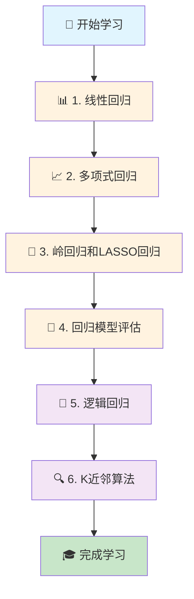

<div align="center">

# 🤖 AI by Doing - 机器学习实战教程


[](https://python.org)
[](https://jupyter.org)
[](https://numpy.org)
[](https://pandas.pydata.org)
[](https://scikit-learn.org)
[](https://matplotlib.org)

**🚀 从零开始，用代码学习机器学习核心算法**

[📚 开始学习](#-学习路径) • [🛠️ 快速开始](#️-快速开始) • [📊 算法列表](#-算法实现) • [🤝 贡献指南](#-贡献指南)

</div>

---

## ✨ 项目特色

<div align="center">

| 🎯 **实战导向** | 📈 **可视化** | 🧠 **算法深度** | 📝 **详细注释** |
|:---:|:---:|:---:|:---:|
| 每个算法都有完整的实现和应用案例 | 丰富的图表和可视化展示 | 从数学原理到代码实现 | 中文注释，易于理解 |

</div>

## 🎯 学习路径



## 📊 算法实现

### 🔢 回归算法

<details>
<summary><b>📊 1. 线性回归 (Linear Regression)</b></summary>

- **📁 目录**: `1.线性回归/`
- **📋 内容**: 
  - 最小二乘法代数求解
  - 平方损失函数实现
  - 北京房价预测案例
- **📊 数据集**: `challenge-1-beijing.csv`
- **🎯 学习目标**: 理解线性关系建模的基础

```python
def least_squares_algebraic(x, y):
    """最小二乘法代数求解"""
    n = x.shape[0]
    w1 = (n * sum(x * y) - sum(x) * sum(y)) / (n * sum(x * x) - sum(x) * sum(x))
    w0 = (sum(x * x) * sum(y) - sum(x) * sum(x * y)) / (n * sum(x * x) - sum(x) * sum(x))
    return w0, w1
```

</details>

<details>
<summary><b>📈 2. 多项式回归 (Polynomial Regression)</b></summary>

- **📁 目录**: `2.多项式回归/`
- **📋 内容**: 
  - 多项式特征扩展
  - 非线性关系建模
  - 比特币价格预测
  - 疫苗效果分析
- **📊 数据集**: 
  - `challenge-2-bitcoin.csv`
  - `course-6-vaccine.csv`
- **🎯 学习目标**: 处理非线性数据关系

</details>

<details>
<summary><b>🎯 3. 岭回归和LASSO回归 (Ridge & LASSO)</b></summary>

- **📁 目录**: `3.岭回归和 LASSO 回归实现/`
- **📋 内容**: 
  - L1和L2正则化
  - 过拟合问题解决
  - 特征选择技术
- **🎯 学习目标**: 理解正则化在机器学习中的重要性

</details>

<details>
<summary><b>📏 4. 回归模型评估 (Model Evaluation)</b></summary>

- **📁 目录**: `4.回归模型评估/`
- **📋 内容**: 
  - R²决定系数
  - 均方误差(MSE)
  - 平均绝对误差(MAE)
  - 广告效果分析
- **📊 数据集**: `advertising.csv`
- **🎯 学习目标**: 掌握模型性能评估方法

</details>

### 🧠 分类算法

<details>
<summary><b>🔄 5. 逻辑回归 (Logistic Regression)</b></summary>

- **📁 目录**: `5.逻辑回归/`
- **📋 内容**: 
  - Sigmoid函数
  - 最大似然估计
  - 二分类问题
  - 考试通过率预测
- **📊 数据集**: `course-8-data.csv`
- **🎯 学习目标**: 从回归到分类的转换

```python
# 逻辑回归核心：Sigmoid函数
def sigmoid(z):
    return 1 / (1 + np.exp(-z))
```

</details>

<details>
<summary><b>🔍 6. K近邻算法 (K-Nearest Neighbors)</b></summary>

- **📁 目录**: `6.K近邻算法实现与应用/`
- **📋 内容**: 
  - 距离度量方法
  - K值选择策略
  - 鸢尾花分类案例
- **📊 数据集**: `course-9-syringa.csv`
- **🎯 学习目标**: 理解基于实例的学习方法

</details>

## 🛠️ 快速开始

### 📋 环境要求

```bash
# Python 3.8+
# 推荐使用 Anaconda 或 Miniconda
```

### 📦 依赖安装

```bash
# 克隆项目
git clone https://github.com/your-username/ai-by-doing.git
cd ai-by-doing

# 安装依赖
pip install numpy pandas matplotlib scikit-learn jupyter

# 或使用 conda
conda install numpy pandas matplotlib scikit-learn jupyter
```

### 🚀 开始学习

```bash
# 启动 Jupyter Notebook
jupyter notebook

# 按顺序打开各个文件夹中的 main.ipynb 文件
# 建议学习顺序：
# 1.线性回归 → 2.多项式回归 → 3.岭回归和LASSO回归 → 
# 4.回归模型评估 → 5.逻辑回归 → 6.K近邻算法
```

## 📁 项目结构

```
ai-by-doing/
├── 📊 1.线性回归/
│   ├── 📓 main.ipynb          # 主要实现
│   ├── 📓 test.ipynb          # 测试代码
│   └── 📄 challenge-1-beijing.csv
├── 📈 2.多项式回归/
│   ├── 📓 main.ipynb
│   ├── 📓 test.ipynb
│   ├── 📄 challenge-2-bitcoin.csv
│   └── 📄 course-6-vaccine.csv
├── 🎯 3.岭回归和 LASSO 回归实现/
│   ├── 📓 mian.ipynb
│   └── 📓 test.ipynb
├── 📏 4.回归模型评估/
│   ├── 📓 mian.ipynb
│   ├── 📓 test.ipynb
│   └── 📄 advertising.csv
├── 🔄 5.逻辑回归/
│   ├── 📓 main.ipynb
│   ├── 📓 test.ipynb
│   └── 📄 course-8-data.csv
├── 🔍 6.K近邻算法实现与应用/
│   ├── 📓 main.ipynb
│   └── 📄 course-9-syringa.csv
├── 📝 README.md
└── 🚫 .gitignore
```

## 🎓 学习成果

完成本教程后，你将掌握：

- ✅ **机器学习基础理论**：理解监督学习的核心概念
- ✅ **算法实现能力**：能够从零实现经典机器学习算法
- ✅ **数据处理技能**：掌握数据预处理和特征工程
- ✅ **模型评估方法**：学会评估和优化模型性能
- ✅ **实际应用经验**：通过真实案例理解算法应用场景
- ✅ **Python编程技能**：提升科学计算和数据分析能力

## 📚 扩展学习

### 📖 推荐资源

- 📘 **《统计学习方法》** - 李航
- 📗 **《机器学习》** - 周志华
- 📙 **《Python机器学习》** - Sebastian Raschka
- 🌐 **Coursera Machine Learning Course** - Andrew Ng
- 🌐 **Kaggle Learn** - 免费在线课程

### 🔗 相关项目

- [Scikit-learn](https://github.com/scikit-learn/scikit-learn) - Python机器学习库
- [TensorFlow](https://github.com/tensorflow/tensorflow) - 深度学习框架
- [PyTorch](https://github.com/pytorch/pytorch) - 深度学习框架

## 🤝 贡献指南

我们欢迎所有形式的贡献！

### 🐛 报告问题

如果你发现了bug或有改进建议，请：

1. 检查是否已有相关issue
2. 创建新的issue，详细描述问题
3. 提供复现步骤和环境信息

### 💡 贡献代码

1. Fork 本项目
2. 创建特性分支 (`git checkout -b feature/AmazingFeature`)
3. 提交更改 (`git commit -m 'Add some AmazingFeature'`)
4. 推送到分支 (`git push origin feature/AmazingFeature`)
5. 创建 Pull Request

### 📝 改进文档

- 修正错别字
- 改进代码注释
- 添加使用示例
- 翻译文档

## 📄 许可证

本项目采用 MIT 许可证 - 查看 [LICENSE](LICENSE) 文件了解详情。

## 🙏 致谢

感谢所有为机器学习教育做出贡献的开发者和研究者。

特别感谢：
- 🐍 **Python社区** - 提供了强大的科学计算生态
- 📊 **Scikit-learn团队** - 优秀的机器学习库
- 📓 **Jupyter项目** - 交互式编程环境
- 🎨 **Matplotlib团队** - 数据可视化工具

---

<div align="center">

**⭐ 如果这个项目对你有帮助，请给我们一个星标！**

**📧 有问题？欢迎联系我们或创建issue**

**🔄 持续更新中... 敬请期待更多算法实现！**


</div>
